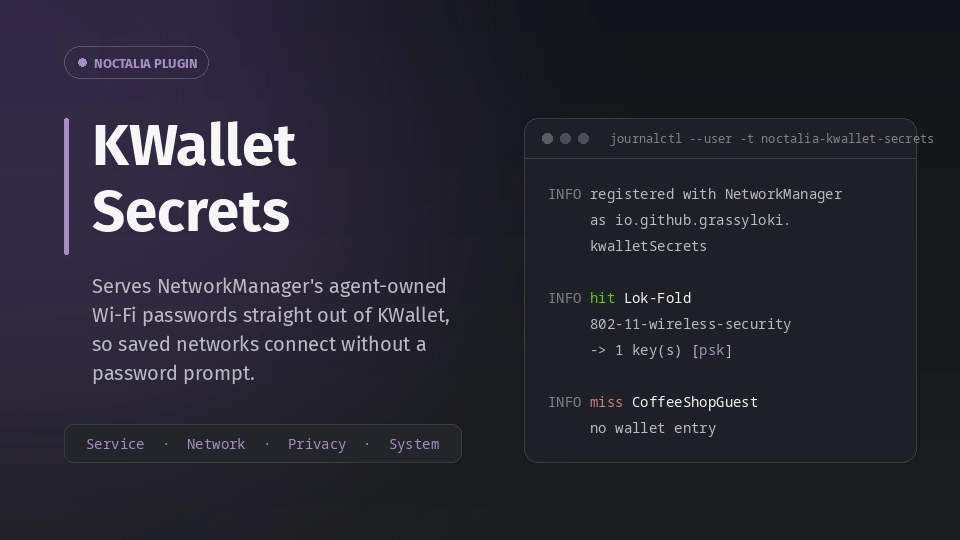

# KWallet Secrets for Noctalia



A [Noctalia](https://github.com/noctalia-dev) plugin that lets NetworkManager
get your saved Wi-Fi, VPN and WireGuard passwords from **KWallet**, so a
Noctalia session connects to known networks without asking you to type them
again.

| | |
| --- | --- |
| Plugin ID | `grassyloki/kwallet-secrets` |
| Version | 1.1.3 ([changelog](#changelog)) |
| Works with | Noctalia 5.1, plugin API 28, any Wayland compositor |
| License | MIT |

## Why you might need it

You move from KDE Plasma to a Noctalia session, click your home Wi-Fi, and get
asked for a password you saved years ago. Your VPN asks too, every single time.

The passwords did not go anywhere. Plasma's network applet (plasma-nm) saves
them in KWallet and marks them *agent-owned*: NetworkManager deliberately keeps
no copy and asks a "secret agent" for the password at connect time. On Plasma,
plasma-nm is that agent. On Noctalia, the only agent is Noctalia's own password
prompt, which has nowhere to look them up. So everything plasma-nm ever saved
turns into a prompt.

This plugin is the missing agent. It answers NetworkManager's requests out of
the same KWallet folder plasma-nm uses, so those networks just connect again. A
password you type into a prompt afterwards is saved there as well, in the same
format, so Plasma and Noctalia stay interchangeable.

It handles:

- **Wi-Fi**: WPA/WPA2/WPA3 personal and WEP.
- **VPNs**: OpenVPN, vpnc, openconnect, L2TP and any other NetworkManager VPN
  plugin, including secondary secrets like a certificate passphrase.
- **WireGuard**: NetworkManager's native WireGuard, private key and per-peer
  preshared keys.
- **WPA-Enterprise** (`802-1x`, eduroam and the like): opt-in, off by default.

## What it does with your passwords

A plugin that hands out Wi-Fi and VPN passwords deserves suspicion, so here is
the short version. The long version, with a diagram of one request and the
commands to check each claim yourself, is
[How your secrets are handled](kwallet-secrets/README.md#how-your-secrets-are-handled).

- **One job.** When NetworkManager needs a password for one saved network or
  VPN, the plugin reads that one entry from KWallet's `Network Management`
  folder and gives it back to NetworkManager. Nothing else in your wallet is
  read.
- **One caller.** Only NetworkManager gets an answer. Ordinary programs cannot
  reach the plugin at all, and other root processes are refused and logged.
- **Nothing kept.** Passwords are not cached, not written to disk, not logged,
  and never sent over the network; the plugin opens no network connection.
- **Your wallet stays yours.** The plugin never sees your wallet password and
  cannot open a locked wallet without you.
- **Easy to stop.** Disabling the plugin stops the agent at once; there are no
  files to clean up.
- **Small enough to read.** All secret handling is one Python file,
  [`kwallet-secrets/scripts/kwallet-nm-agent.py`](kwallet-secrets/scripts/kwallet-nm-agent.py),
  with no dependencies beyond your distribution's D-Bus bindings.

## Install

### Requirements

| Needed | Arch package | Why |
| --- | --- | --- |
| NetworkManager | `networkmanager` | The network stack the plugin answers. |
| `kwalletd6` | `kwallet` | The wallet daemon, over its `org.kde.KWallet` D-Bus interface. `ksecretd` alone is not enough. |
| `python3` + D-Bus bindings | `python`, `python-dbus`, `python-gobject` | Runs the agent. Distro packages only: no pip, no virtualenv. |
| `pkill`, `systemd-cat` | `procps-ng`, `systemd` | Start and stop the agent, and send its log to the journal. |
| *Recommended:* wallet unlocked at login | `kwallet-pam` | Without it, the first connection of a session raises KWallet's unlock dialog. |

On Debian and Ubuntu the bindings are `python3-dbus` and `python3-gi`.

**Unlocking the wallet at login outside Plasma.** `kwallet-pam` only finishes
unlocking once `/usr/lib/pam_kwallet_init` runs inside the session. Plasma runs
it for you; other sessions have to start it themselves, early. On niri, for
example, make this the first line of the startup list in
`~/.config/niri/config.kdl`:

```kdl
spawn-at-startup "/usr/lib/pam_kwallet_init"
```

This only unlocks the wallet if its password is the same as your login
password. If the wallet is still locked when a network connects, that first
attempt fails and is retried automatically once you unlock the wallet.

### From the Noctalia plugin store

Open **Settings, Plugins**, find **KWallet Secrets** and enable it. From a
terminal, with the default `community` source:

```sh
noctalia msg plugins enable grassyloki/kwallet-secrets
```

Releases reach the store after upstream review, so the store can be a version
behind this repository; the [changelog](#changelog) lists what each version
fixed.

### From this repository

To run the newest version, add this repository as a plugin source:

```sh
noctalia msg plugins source add grassyloki git https://github.com/Grassyloki/noctalia-kwallet-secrets
noctalia msg plugins enable grassyloki/kwallet-secrets
```

### Check that it is working

```sh
# NetworkManager should list the agent io.github.grassyloki.kwalletSecrets:
journalctl -b -t NetworkManager | grep 'agent registered'

# The plugin's own log: one line per request, key names only, never a value.
journalctl --user -t noctalia-kwallet-secrets -f
```

Connect to a saved network and a line like this should appear:

```
INFO hit HomeWiFi (6fec006a-…) 802-11-wireless-security -> 1 key(s) [psk]
```

`hit` means the password came from the wallet. `miss` means the wallet has no
entry for that network, so you get Noctalia's normal prompt, and the password
you type is normally saved to the wallet for next time.

## Settings

All settings are under **Settings, Plugins, KWallet Secrets**. Changing one
restarts the agent.

| Setting | Default | In short |
| --- | --- | --- |
| `wallet_name` | *(empty)* | Which wallet to read; empty means KWallet's network wallet, normally `kdewallet`. |
| `folder_name` | `Network Management` | The wallet folder plasma-nm uses. |
| `app_id` | `Noctalia KWallet Secrets` | The name KWallet shows if it asks to allow access. |
| `handle_8021x` | off | Also answer WPA-Enterprise requests. |
| `handle_vpn` | on | Also answer VPN and WireGuard requests. |
| `unlock_prompt` | on | Let KWallet show its unlock dialog when the wallet is locked. |
| `debug_logging` | off | Log every request, including declined ones. Values are never logged. |

The [plugin README](kwallet-secrets/README.md#settings) describes each one in
full.

## How it works

```
  Noctalia ── service.luau ── starts, watches, stops ──┐
                                                        v
  NetworkManager <── system D-Bus ──> kwallet-nm-agent.py <── session D-Bus ──> kwalletd6
  (asks for a                          (the secret agent,                        (your
   password)                            runs as you)                              wallet)
```

| Part | What it does | Sees passwords? |
| --- | --- | --- |
| [`service.luau`](kwallet-secrets/service.luau) | Noctalia service. Checks the dependencies, starts the agent with your settings as command-line flags, checks every 30 seconds that it is alive, and stops it when the plugin is disabled. | No |
| [`scripts/kwallet-nm-agent.py`](kwallet-secrets/scripts/kwallet-nm-agent.py) | Registers with NetworkManager as a secret agent. Answers its `GetSecrets`, `SaveSecrets` and `DeleteSecrets` calls by reading and writing KWallet entries named `{uuid};<setting>`, exactly as plasma-nm does. | Yes, one at a time, in memory only |
| [`plugin.toml`](kwallet-secrets/plugin.toml) | Plugin manifest: id, version, settings, dependencies. | No |

When a password is missing, the agent answers NetworkManager's "not mine" error,
and NetworkManager asks the next agent in line, normally Noctalia's prompt. The
plugin adds a way to connect; it never takes one away.

The [plugin README](kwallet-secrets/README.md#how-it-works) has the details:
the VPN and WireGuard reply formats, KWallet's on-the-wire map encoding, and how
the agent copes with a locked wallet or a restarted wallet daemon.

## Troubleshooting

**A network still asks for its password.** Check how that profile stores it:

```sh
nmcli -g 802-11-wireless-security.psk-flags connection show "Network name"
```

`0` means NetworkManager stores the password itself, and the plugin is never
asked; if that stored password is wrong, fix it in NetworkManager. `1` means it
is agent-owned, so look at the plugin's log for that connection: `miss` means
the wallet has no entry for it, and `wallet locked` means the wallet was not
unlocked yet.

**Nothing appears in the plugin's log when you connect.** Another agent took
the request first. NetworkManager asks the most recently started agent first, so
if `kded6` is running (common on systems that also have Plasma installed),
plasma-nm's agent outranks this one. Check for it, and unload it for the session:

```sh
busctl --user call org.kde.kded6 /kded org.kde.kded6 loadedModules | grep -o networkmanagement
busctl --user call org.kde.kded6 /kded org.kde.kded6 unloadModule s networkmanagement
```

**The wallet unlock dialog appears at every login.** `pam_kwallet_init` is not
running in your session, or your wallet password differs from your login
password; see [Requirements](#requirements).

**See what the wallet holds.** This lists entry and key *names*, never values:

```sh
~/.local/state/noctalia/plugins/materialized/community/kwallet-secrets/scripts/kwallet-nm-agent.py \
  --check --with-vpn --with-8021x
```

## Changelog

| Version | Date | Changes |
| --- | --- | --- |
| 1.1.3 | 2026-09-26 | Disabling or uninstalling the plugin now stops the agent; before, it kept running and kept answering NetworkManager. The agent no longer keeps Noctalia's open files it inherited at launch. A new README section explains how secrets are handled. |
| 1.1.2 | 2026-09-26 | **Security:** the agent answers NetworkManager only. Before, any root process could ask it for a decrypted password. Ordinary users were never able to. |
| 1.1.1 | 2026-09-12 | Fixed passwords silently not being found after the wallet daemon restarted (every login, every KWallet upgrade). A connection that fails on a locked wallet now retries by itself once the wallet unlocks. |
| 1.1.0 | 2026-09-09 | VPN and WireGuard secrets, including WireGuard per-peer preshared keys. First version in the community store. |
| 1.0.0 | 2026-09-02 | Wi-Fi and WPA-Enterprise secrets from KWallet. |

## Repository layout

```
kwallet-secrets/                the plugin, exactly as it ships to the store
  plugin.toml                   manifest: id, version, settings, dependencies
  service.luau                  Noctalia service: starts and supervises the agent
  scripts/kwallet-nm-agent.py   the NetworkManager secret agent
  translations/en.json          setting labels and error messages
  README.md                     full plugin documentation
  thumbnail.webp                store image
  LICENSE
LICENSE                         same MIT license, at the root so GitHub finds it
README.md                       this file
```

The plugin directory has to stay at the repository root, named after the part
of its id after the `/`. That is how both a `git` plugin source and the
community-plugins repository find it.

## Development

Register a checkout as a `path` source to run straight from your working tree:

```sh
noctalia msg plugins source add dev path ~/Projects/noctalia-kwallet-secrets
noctalia msg plugins update dev
```

`.luau` edits hot-reload. `plugin.toml` changes need `noctalia msg plugins
update dev`. To run the agent by hand with verbose logging, stop the supervised
copy first, because a second copy exits on its single-instance lock:

```sh
pkill -f 'kwallet-nm-agent[.]py'
./kwallet-secrets/scripts/kwallet-nm-agent.py --debug --with-vpn
```

Noctalia starts its own copy again within 30 seconds after yours exits.

**Publishing to the store.** Releases go to
[noctalia-dev/community-plugins](https://github.com/noctalia-dev/community-plugins)
as a pull request. The maintainer's script for that lives in an untracked
`.publishing/` directory. By hand, the steps are:

1. Bump `version` in `plugin.toml` and commit.
2. In a fork checkout of community-plugins, reset a branch to `upstream/main`.
3. Extract the plugin with `git archive HEAD kwallet-secrets | tar -x`, not a
   filesystem copy, which would bring ignored files like `__pycache__/` along.
4. Stage only `kwallet-secrets/`; CI generates `catalog.toml`.
5. Open the PR using upstream's template, and copy its checklist lines word for
   word: CI matches them exactly.

## License

MIT. See [LICENSE](LICENSE).
